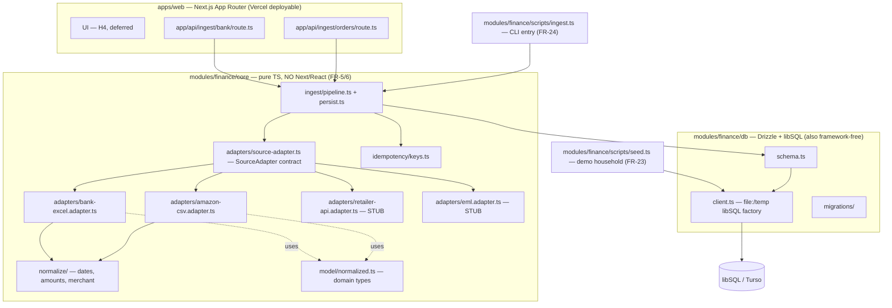

# H1 — Foundation & Ingestion: System Architecture

> Module: `modules/finance` · Deployable: `apps/web` (Next.js App Router, Vercel) · Status: greenfield, this epic only.

## Architecture Philosophy

Four constraints drive every decision below. Where a decision trades something away, the trade is named explicitly in the ADR log.

1. **The core must outlive the framework.** All business logic lives in `modules/finance/core` as pure TypeScript with zero Next/React imports, enforced by an automated boundary check (FR-5, FR-6). Route handlers are thin adapters that call in. This is the single most load-bearing constraint: H2/H3/H4 inherit this core, and a leak now is a leak we carry forever.
2. **Ingestion is idempotent or it is wrong.** Re-importing the same file must produce zero new rows (FR-19). Idempotency is enforced at the storage layer via deterministic unique keys, not at query time — so a crash mid-import or a double-click on the demo cannot corrupt the ledger.
3. **The schema is built end-to-end now, populated incrementally later.** Every table H2/H3/H4 will consume (`receipts`, `receipt_items`, `matches`, `categories`, `store_credit_balances`) ships in H1 so downstream epics need no new migrations (Goal 3). H1 leaves most of them empty by design.
4. **No real financial data ever touches git, and the suite runs offline.** `.gitignore` from commit #1 (FR-4, NFR-2); fixtures are sanitized-real (FR-22); tests run against a `file:`/temp libSQL DB with no network (NFR-1, NFR-3). Credibility of the whole platform rests on this.

## Component Diagram



Dependency direction is one-way: `apps/web` → `core` → `db`. `db` imports nothing from `core`; `core` imports nothing from `apps/web`. This is what the boundary check guards.

## Tech Stack

| Layer | Choice | Rationale |
|---|---|---|
| Monorepo | pnpm workspaces | Fixed by NFR-6. Cheap, no build orchestrator needed at this size; `modules/*` + `apps/*` is the whole graph. |
| Deployable app | Next.js App Router + TypeScript | Fixed by NFR-6. One deployable. Route handlers are the only framework seam touching the core. |
| Styling / UI | Tailwind + shadcn/ui (copy-in) + `geist` (font package only) | Fixed by NFR-6. `geist` is the font package — **not** `@geist-ui/core` (FR-2). UI itself is H4; H1 only configures the toolchain. |
| Database | libSQL / Turso | Fixed by NFR-6. SQLite-compatible, works as a `file:` DB locally and Turso in prod — same engine offline and deployed (NFR-1). |
| ORM / migrations | Drizzle ORM (`drizzle-orm/libsql`, `drizzle-kit`) | Fixed by NFR-6. Framework-agnostic, typed schema doubles as the source of truth for downstream epics. |
| Spreadsheet parse | SheetJS (`xlsx`) | Excel is the dependable demo path (FR-17). Reads cell **values**, not formulas — closes the CSV/formula-injection vector by default. |
| CSV parse | `csv-parse` (node stream/sync) | Boring, well-tested, handles quoting/embedded newlines in Amazon exports. |
| Test runner | Vitest | Fixed by NFR-4. Runs the offline `file:`/temp DB suite; test-first, red→green. |
| Hashing | Node `crypto` (SHA-256) | Deterministic idempotency keys; no dependency. |
| Deploy | Vercel | Fixed by NFR-6. Env vars (Turso URL/token) live in Vercel, never in git. |

## Data Models

Money is stored as **signed integer cents** (`integer` columns) everywhere — never floats, never decimal strings. Dates are stored as ISO‑8601 `text` (`YYYY-MM-DD` for posted dates, full timestamp for `*_at`). IDs are application-generated UUID `text` PKs. Sign convention: **negative = money leaving / a return line; positive = money entering / a purchase line.**

DDL below is the libSQL shape; it is authored as Drizzle `sqlite-core` in `modules/finance/db/schema.ts` and `drizzle-kit generate` produces the migration.

```sql
-- ── Households / accounts / bank transactions ──────────────────────── (FR-10)
CREATE TABLE households (
  id          TEXT PRIMARY KEY,
  name        TEXT NOT NULL,
  created_at  TEXT NOT NULL DEFAULT (datetime('now'))
);                       -- NFR-5: schema ALLOWS many; H1 seeds exactly one.

CREATE TABLE accounts (
  id            TEXT PRIMARY KEY,
  household_id  TEXT NOT NULL REFERENCES households(id),
  name          TEXT NOT NULL,
  institution   TEXT,
  account_type  TEXT NOT NULL,            -- 'checking' | 'credit' | ...
  last_four     TEXT,                     -- sanitized only; never full PAN
  created_at    TEXT NOT NULL DEFAULT (datetime('now'))
);

CREATE TABLE transactions (
  id                  TEXT PRIMARY KEY,
  account_id          TEXT NOT NULL REFERENCES accounts(id),
  posted_date         TEXT NOT NULL,      -- normalized ISO date
  amount_cents        INTEGER NOT NULL,   -- signed: debit < 0, credit > 0
  direction           TEXT NOT NULL,      -- 'debit' | 'credit' (mirrors sign, query convenience)
  raw_merchant        TEXT,
  normalized_merchant TEXT NOT NULL,
  source              TEXT NOT NULL,      -- 'bank'
  source_row_hash     TEXT NOT NULL,      -- hash of the original row cells
  dedup_key           TEXT NOT NULL,      -- see idempotency, FR-16
  created_at          TEXT NOT NULL DEFAULT (datetime('now'))
);
CREATE UNIQUE INDEX ux_transactions_dedup ON transactions(dedup_key);

-- ── Orders / order line items ──────────────────────────────────────── (FR-11)
CREATE TABLE orders (
  id                TEXT PRIMARY KEY,
  household_id      TEXT NOT NULL REFERENCES households(id),
  source            TEXT NOT NULL,        -- 'amazon'
  external_order_id TEXT NOT NULL,        -- Amazon order id
  order_date        TEXT NOT NULL,
  currency          TEXT NOT NULL DEFAULT 'USD',
  order_total_cents INTEGER,
  created_at        TEXT NOT NULL DEFAULT (datetime('now'))
);
CREATE UNIQUE INDEX ux_orders_external
  ON orders(household_id, source, external_order_id);

CREATE TABLE order_items (
  id                  TEXT PRIMARY KEY,
  order_id            TEXT NOT NULL REFERENCES orders(id),
  shipment_id         TEXT NOT NULL,      -- per-shipment identifier (FR-11)
  item_seq            INTEGER NOT NULL,   -- line index within (order, shipment)
  description         TEXT NOT NULL,
  quantity            INTEGER NOT NULL DEFAULT 1,
  unit_price_cents    INTEGER,
  amount_cents        INTEGER NOT NULL,   -- signed: return/refund line < 0 (FR-15)
  is_return           INTEGER NOT NULL DEFAULT 0,   -- boolean; derived from sign
  refund_destination  TEXT,               -- NULL on purchases; enum on returns (FR-15)
                                          --   'card' | 'store_credit' | 'gift_card' | 'account_balance'
  source_row_hash     TEXT NOT NULL,
  created_at          TEXT NOT NULL DEFAULT (datetime('now'))
);
CREATE UNIQUE INDEX ux_order_items_line
  ON order_items(order_id, shipment_id, item_seq);   -- (order + shipment + item) key (FR-16)

-- ── Receipts (H2: tables only, unpopulated in H1) ──────────────────── (FR-12)
CREATE TABLE receipts (
  id            TEXT PRIMARY KEY,
  household_id  TEXT NOT NULL REFERENCES households(id),
  captured_at   TEXT,
  merchant      TEXT,
  total_cents   INTEGER,
  image_ref     TEXT,                     -- path/handle only; image bytes live in gitignored data/
  status        TEXT NOT NULL DEFAULT 'pending',
  created_at    TEXT NOT NULL DEFAULT (datetime('now'))
);

CREATE TABLE receipt_items (
  id               TEXT PRIMARY KEY,
  receipt_id       TEXT NOT NULL REFERENCES receipts(id),
  line_index       INTEGER NOT NULL,
  description      TEXT,
  quantity         INTEGER,
  unit_price_cents INTEGER,
  amount_cents     INTEGER,               -- signed, same convention as order_items
  created_at       TEXT NOT NULL DEFAULT (datetime('now'))
);

-- ── Matches (H3: table only) + categories (H3: schema only) ────────── (FR-13)
CREATE TABLE matches (
  id              TEXT PRIMARY KEY,
  household_id    TEXT NOT NULL REFERENCES households(id),
  transaction_id  TEXT REFERENCES transactions(id),
  order_id        TEXT REFERENCES orders(id),
  order_item_id   TEXT REFERENCES order_items(id),
  receipt_id      TEXT REFERENCES receipts(id),
  receipt_item_id TEXT REFERENCES receipt_items(id),
  match_type      TEXT,                   -- H3 vocabulary
  confidence      REAL,
  status          TEXT NOT NULL DEFAULT 'proposed',
  created_at      TEXT NOT NULL DEFAULT (datetime('now'))
);

CREATE TABLE categories (
  id            TEXT PRIMARY KEY,
  household_id  TEXT REFERENCES households(id),   -- nullable: allows global defaults
  name          TEXT NOT NULL,
  parent_id     TEXT REFERENCES categories(id),
  created_at    TEXT NOT NULL DEFAULT (datetime('now'))
);

-- ── Store-credit ledger (H1 records accruals; H3 records drawdown) ─── (FR-14)
CREATE TABLE store_credit_balances (
  id            TEXT PRIMARY KEY,
  household_id  TEXT NOT NULL REFERENCES households(id),
  source        TEXT NOT NULL,            -- 'amazon' | ...
  order_id      TEXT REFERENCES orders(id),
  order_item_id TEXT REFERENCES order_items(id),
  kind          TEXT NOT NULL,            -- 'store_credit' | 'gift_card' | 'account_balance'
  amount_cents  INTEGER NOT NULL,         -- append-only ledger: H1 writes positive accruals;
                                          --   H3 writes negative drawdown rows. Balance = SUM.
  currency      TEXT NOT NULL DEFAULT 'USD',
  occurred_at   TEXT NOT NULL,
  note          TEXT,
  created_at    TEXT NOT NULL DEFAULT (datetime('now'))
);
```

**The refund-destination decision tree** (FR-15, the *Must* story "money flowing back is never lost or double-counted"):

```
return/refund line  →  amount_cents < 0  (always, regardless of destination)
  refund_destination = 'card'            → reconcilable against a bank credit transaction (H3); NO ledger row
  refund_destination ∈ {store_credit,
                        gift_card,
                        account_balance}  → NOT on the card; write ONE positive store_credit_balances accrual row
```

## API / Interface Contracts

These are the seams every story must agree on. Full ownership/signature reconciliation is in the implementation contract (Task C); the load-bearing signatures are below.

### The `SourceAdapter` contract — `modules/finance/core/adapters/source-adapter.ts` (FR-7)

```ts
export type SourceKind = 'bank' | 'amazon' | 'receipt' | 'retailer-api' | 'eml';

// File-based only — no live network auth anywhere (NFR-3).
export interface RawInput {
  kind: SourceKind;
  filename: string;
  bytes: Uint8Array;
  mimeType?: string;
}

// The common normalization target: any source resolves into this shape.
export interface NormalizedBatch {
  transactions: NormalizedTransaction[]; // bank → here
  orders: NormalizedOrder[];             // amazon → here (each carries its items)
  receipts: NormalizedReceipt[];         // H2 → here; empty in H1
  errors: ImportError[];                 // malformed rows, never silently dropped (FR-20)
}

export interface SourceAdapter {
  readonly kind: SourceKind;
  supports(input: RawInput): boolean;
  normalize(input: RawInput): NormalizedBatch | Promise<NormalizedBatch>;
}
```

### Normalized domain model — `modules/finance/core/model/normalized.ts`

```ts
export interface NormalizedTransaction {
  postedDate: string;          // ISO YYYY-MM-DD
  amountCents: number;         // signed
  direction: 'debit' | 'credit';
  rawMerchant?: string;
  normalizedMerchant: string;
  sourceRowHash: string;
}

export type RefundDestination = 'card' | 'store_credit' | 'gift_card' | 'account_balance';

export interface NormalizedOrderItem {
  shipmentId: string;
  itemSeq: number;
  description: string;
  quantity: number;
  unitPriceCents?: number;
  amountCents: number;         // signed: return < 0
  isReturn: boolean;
  refundDestination?: RefundDestination;  // set only where the source states it
  sourceRowHash: string;
}

export interface NormalizedOrder {
  source: 'amazon';
  externalOrderId: string;
  orderDate: string;
  currency: string;
  orderTotalCents?: number;
  items: NormalizedOrderItem[];
}

export interface ImportError {
  rowRef: string;              // e.g. "row 42" / "order ABC shipment 2"
  reason: string;
  raw?: unknown;
}
```

### Ingest pipeline & persistence — `modules/finance/core/ingest/`

```ts
// pipeline.ts — picks the adapter, normalizes, persists; returns a structured result.
export interface ImportResult {
  inserted: { transactions: number; orders: number; orderItems: number; storeCreditRows: number };
  skippedDuplicates: number;     // idempotency in action (FR-19)
  errors: ImportError[];         // FR-20
}

export function importSource(
  db: FinanceDb,                 // injected handle — never a module singleton (testability)
  input: RawInput,
  ctx: { householdId: string; accountId?: string },
): Promise<ImportResult>;
```

### Idempotency keys — `modules/finance/core/idempotency/keys.ts` (FR-16)

```ts
// transactions: (account + date + amount + normalized merchant + source-row hash)
export function transactionDedupKey(p: {
  accountId: string; postedDate: string; amountCents: number;
  normalizedMerchant: string; sourceRowHash: string;
}): string;   // SHA-256 hex of the joined, canonicalized fields

// order lines: the natural key (order_id + shipment + item) — enforced by ux_order_items_line.
```

### DB client factory — `modules/finance/db/client.ts` (NFR-1)

```ts
export type FinanceDb = ReturnType<typeof drizzle>;   // drizzle(libsql client)

// Resolution order: explicit url → env (TURSO_DATABASE_URL/AUTH_TOKEN) →
//   file: DB for local/dev → per-run temp file fallback if :memory: unsupported.
export function createDb(opts?: { url?: string; authToken?: string }): FinanceDb;
export function createTestDb(): { db: FinanceDb; cleanup: () => void };  // fresh schema per test
```

### Framework seam — `apps/web/app/api/ingest/{bank,orders}/route.ts` (FR-5)

```
POST /api/ingest/bank      multipart/form-data { file, accountId }
POST /api/ingest/orders    multipart/form-data { file }
  → reads bytes → builds RawInput → importSource(createDb(), input, ctx) → 200 { ImportResult }
```

The route handler does **only** request parsing and response shaping. All logic is in the core. This is the file that `story-001-006`'s integration test imports directly — the *real* route/service, not a fixture app (FR-25).

### Stubbed slots (FR-9) — interface present, no implementation

```ts
// retailer-api.adapter.ts / eml.adapter.ts
export const retailerApiAdapter: SourceAdapter = {
  kind: 'retailer-api',
  supports: () => false,
  normalize() { throw new Error('NotImplemented: retailer-api adapter is a stub (H1 FR-9)'); },
};
```

## Security Model

H1 has no auth (single household, NFR-5) and no live network ingestion (NFR-3), which removes most of the attack surface. The threats that remain are about data hygiene and file handling.

| Threat | Control |
|---|---|
| Real financial data committed to git (the existential risk) | `.gitignore` excludes `data/`, raw uploads, local DB files, `.env*` from commit #1 (FR-4, NFR-2). `story-001-007` verifies the exclusion is provable from commit #1's `.gitignore`. Fixtures are sanitized-real: fake account numbers, real structure (FR-22). |
| Secrets (Turso URL/token) leaking | `.env*` gitignored; secrets live in Vercel env vars and are read via `createDb()` env resolution. Never hard-coded, never in fixtures. |
| Spreadsheet formula / CSV injection from a crafted export | SheetJS reads cell **values**, not formulas; we never `eval`. Any future CSV *export* must prefix `= + - @` cells — noted for H4, out of scope here. |
| Malformed / hostile rows crashing or silently corrupting ingest | Malformed rows are skipped and surfaced as structured `ImportError`s — never silently dropped (FR-20). Idempotency keys (FR-16) make re-running after a partial failure safe. |
| PII at rest beyond what's needed | Only `last_four` is stored for accounts; no full account/card numbers in schema or fixtures. |
| Path traversal via CLI file arguments | `scripts/ingest.ts` resolves and validates input paths; reads bytes only, executes nothing. |
| Resource exhaustion (huge upload) | File-based, local, single-user in H1 — accepted. Route-level size limits deferred to H4 when the UI exposes upload publicly. |

## ADR Log

### ADR-001 — Money as signed integer cents
**Decision:** Store all monetary values as signed `integer` cents; never floats or decimal strings.
**Context:** Reconciliation (H3) requires exact equality and summation across transactions, order lines, and ledger rows.
**Rationale:** Integer arithmetic is exact and SQLite-native; one consistent unit across every table avoids per-query conversion bugs.
**Trade-off:** Assumes 2-decimal currencies and one currency per value; a `currency` column is carried but mixed-currency math is out of scope. Multi-decimal currencies would need a unit revisit.

### ADR-002 — Returns as signed-negative line items + `refund_destination` enum (not a separate returns table)
**Decision:** A return/refund is an `order_items` row with `amount_cents < 0` carrying `refund_destination` (`card` | `store_credit` | `gift_card` | `account_balance`).
**Context:** FR-15 and the *Must* user story: money flowing back must never be lost or double-counted. The reconcilable-vs-not distinction is the whole point — a card refund hits the bank; the others don't.
**Rationale:** Keeping returns in the same table means a single `SUM(amount_cents)` per order/shipment nets to the true economic value with no join. The enum cleanly routes the non-card cases into the store-credit ledger.
**Trade-off:** Sign convention must be respected everywhere; a consumer that filters `amount > 0` silently drops returns. Mitigated by the `is_return` flag and explicit documentation at the seam.

### ADR-003 — Storage-level idempotency via deterministic unique keys
**Decision:** Dedup is enforced by unique indexes — `ux_transactions_dedup` on a SHA-256 `dedup_key`, and `ux_order_items_line` on `(order_id, shipment_id, item_seq)` — with insert-or-ignore semantics.
**Context:** FR-19 requires re-import to produce zero duplicates, and the demo will re-run the same files.
**Rationale:** The database is the single arbiter; correctness doesn't depend on importer control flow, so a crash or double-run is safe. Query-time dedup would be racy and slower.
**Trade-off:** Two *legitimately distinct* same-day/same-amount/same-merchant transactions collide unless `source_row_hash` distinguishes them (PRD assumption). If a bank export collapses such rows, the transaction key must be revisited — called out as an open assumption, not silently handled.

### ADR-004 — Full end-to-end schema in H1; populated incrementally
**Decision:** Ship every table (incl. `receipts`, `receipt_items`, `matches`, `categories`, `store_credit_balances`) in one H1 migration; leave H2/H3 tables empty.
**Context:** Goal 3 — H2/H3 must build without reshaping the foundation or adding migrations.
**Rationale:** One coherent schema reviewed once; downstream epics import types and write rows with no DDL churn or migration-ordering hazards across parallel epics.
**Trade-off:** We commit to table shapes before their consumers are fully designed; some columns may prove imperfect for H3. Accepted because reshaping a near-empty table later is cheap, and the coordination cost of per-epic migrations is high.

### ADR-005 — `store_credit_balances` as an append-only ledger
**Decision:** Model store credit as ledger rows (positive accruals in H1, negative drawdown in H3); balance = `SUM(amount_cents)`.
**Context:** FR-14 records balances on refund-as-store-credit now; drawdown is H3.
**Rationale:** Append-only ledgers are auditable and never lose history — you can always explain a balance by replaying rows. H3 adds drawdown without mutating H1's rows.
**Trade-off:** Reading a current balance requires aggregation rather than a single stored number. At single-household scale this is negligible; a materialized balance can be added later if needed.

### ADR-006 — `file:`/temp libSQL for tests, not `:memory:` or better-sqlite3
**Decision:** Tests and local dev use a `file:` libSQL DB, falling back to a per-run temp file when `:memory:` is unsupported. `better-sqlite3` and on-disk SQLite are banned.
**Context:** NFR-1/NFR-3 — the suite must run offline and use the *same engine* as production (Turso).
**Rationale:** Same client, same SQL dialect locally and deployed — no "works in tests, breaks on Turso" divergence. `file:`/temp sidesteps libSQL's `:memory:` quirks while staying offline.
**Trade-off:** Tests touch the filesystem (slightly slower than pure memory) and must clean up temp files (`createTestDb().cleanup`). Worth it for engine parity.

### ADR-007 — Unified `SourceAdapter` → `NormalizedBatch`, not per-source pipelines
**Decision:** Every source (bank Excel/CSV, Amazon CSV, future receipt/retailer/eml) implements one `SourceAdapter` that normalizes into a common `NormalizedBatch`; one shared persist step consumes it.
**Context:** FR-7/FR-8/FR-9 and the downstream *Must* story: H2/H3/H4 build on a single contract.
**Rationale:** Idempotency, error handling, and persistence are written once and shared. New sources (H2 receipts) plug in without touching the pipeline. Stubs satisfy the contract today so the shape is locked.
**Trade-off:** `NormalizedBatch` carries `transactions`, `orders`, and `receipts` arrays even though any one adapter fills only one — a slightly looser type than per-source returns. Accepted: the uniform seam is worth more than tight per-source typing.

### ADR-008 — Core depends on Drizzle directly; no repository-port abstraction
**Decision:** Core importers take an injected `FinanceDb` (Drizzle handle) and call Drizzle directly. No repository interface is introduced in H1.
**Context:** FR-5 demands a framework-agnostic core; Drizzle/libSQL are framework-agnostic, so they're allowed in core. The only requirement is testability against a fresh DB.
**Rationale:** Dependency injection of the DB handle gives full testability (`createTestDb()`) without a speculative port/adapter layer. "Design for the system that exists" — a second persistence backend is not on any roadmap.
**Trade-off:** Swapping persistence later means touching importer internals. Cheap to add a port if a real second backend ever appears; premature now.

### ADR-009 — Monorepo split: `apps/web` + `modules/finance`, boundary check on `core`
**Decision:** Next.js lives in `apps/web`; all logic lives in `modules/finance` (`core` + `db`). An automated check fails on any Next/React import inside `modules/finance/core`.
**Context:** FR-5/FR-6 — extractability is Goal 1, and the boundary must be machine-enforced, not convention.
**Rationale:** Physical separation makes the dependency direction obvious and the check trivial (scan `core` for `next`/`react` imports). `db` is also framework-free by nature; the check is scoped to `core` where the risk of accidental coupling is highest.
**Trade-off:** Slightly more package wiring than a single Next app. Worth it — this boundary is the foundation every later epic stands on.

### ADR-010 — Excel-primary ingestion; PDF deferred and non-blocking
**Decision:** Bank ingestion targets Excel (`.xlsx/.xls` via SheetJS) as primary with CSV supported; PDF (via the H2 vision path) is build-if-time and must never block the suite going green.
**Context:** FR-17 and the PRD assumption that PDF is best-effort.
**Rationale:** Excel is the dependable demo path; gating the suite on a vision/LLM path would violate "runs offline, green" (Goal 4, NFR-1). Excel serial-date handling explicitly guards the 1900 leap-year bug (FR-18).
**Trade-off:** A real-world PDF-only bank statement isn't ingestible in H1. Accepted per PRD; the `SourceAdapter` contract leaves room to add it without reshaping the pipeline.
